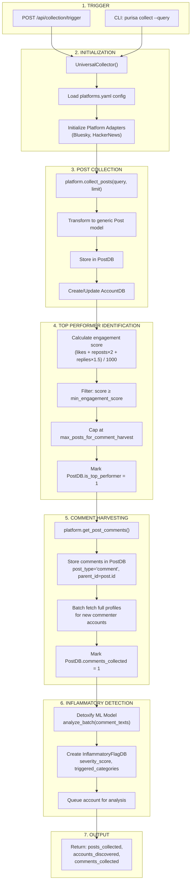
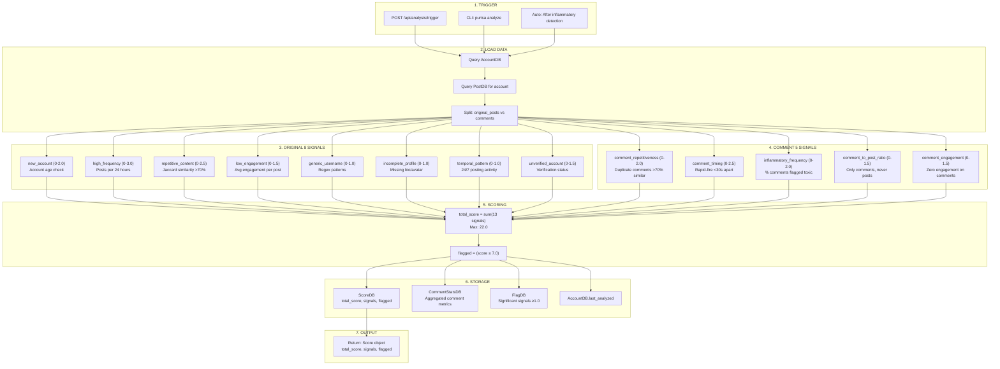

# Purisa Bot Detection System - Flow Diagrams

Technical documentation for the collection and analysis pipelines.

---

## Collection Flow

How posts and comments are collected from social media platforms.



### Key Files - Collection

| Component | File | Lines |
|-----------|------|-------|
| API Endpoint | `backend/purisa/api/routes.py` | 372-441 |
| Collector Service | `backend/purisa/services/collector.py` | 23-560 |
| Batch Profile Fetch | `backend/purisa/services/collector.py` | 464-511 |
| Bluesky Adapter | `backend/purisa/platforms/bluesky.py` | 68-270 |
| Inflammatory Detector | `backend/purisa/services/inflammatory.py` | 26-182 |
| Database Models | `backend/purisa/database/models.py` | 17-183 |

### Configuration Parameters (Comment Harvesting)

The relationship between collection parameters and comment harvesting:

```
limit (API/CLI parameter)
    │
    ▼
┌──────────────────────────────────────┐
│ Collect N posts from platform        │
│ (controlled by 'limit' parameter)    │
└──────────────────────────────────────┘
    │
    ▼
┌──────────────────────────────────────┐
│ Filter by engagement score           │
│ (min_engagement_score threshold)     │
│                                      │
│ Example: 100 posts → 40 qualify      │
└──────────────────────────────────────┘
    │
    ▼
┌──────────────────────────────────────┐
│ Cap at max_posts_for_comment_harvest │
│                                      │
│ Example: 40 qualifying → 50 cap      │
│          = 40 selected (no capping)  │
│                                      │
│ Example: 60 qualifying → 50 cap      │
│          = 50 selected (10 skipped)  │
└──────────────────────────────────────┘
    │
    ▼
┌──────────────────────────────────────┐
│ Harvest comments from selected posts │
│ (max_comments_per_post per post)     │
└──────────────────────────────────────┘
```

| Parameter | Default | Location | Purpose |
|-----------|---------|----------|---------|
| `limit` | 100 | API/CLI | Max posts to collect initially |
| `min_engagement_score` | 0.01 | platforms.yaml | Threshold for "top performer" |
| `max_posts_for_comment_harvest` | 50 | platforms.yaml | Cap on posts to harvest comments from |
| `max_comments_per_post` | 100 | platforms.yaml | Max comments per top post |
| `fetch_commenter_profiles` | true | platforms.yaml | Fetch full profiles for commenters |

**Best Practice:** Set `limit >= 2 * max_posts_for_comment_harvest` to ensure enough posts qualify.

---

## Analysis Flow

How bot detection scoring works using 13 behavioral signals.



### Key Files - Analysis

| Component | File | Lines |
|-----------|------|-------|
| API Endpoint | `backend/purisa/api/routes.py` | 444-483 |
| Analyzer Service | `backend/purisa/services/analyzer.py` | 23-795 |
| Original Signals | `backend/purisa/services/analyzer.py` | 416-682 |
| Comment Signals | `backend/purisa/services/analyzer.py` | 96-334 |
| Score Storage | `backend/purisa/services/analyzer.py` | 684-734 |
| Database Models | `backend/purisa/database/models.py` | 134-230 |

---

## Signal Reference

### Original Signals (Profile & Post Behavior)

| # | Signal | Max | Detection Method |
|---|--------|-----|------------------|
| 1 | new_account | 2.0 | Account age < 30 days |
| 2 | high_frequency | 3.0 | >24 posts in 24 hours |
| 3 | repetitive_content | 2.5 | Jaccard similarity >70% across posts |
| 4 | low_engagement | 1.5 | Avg likes+reposts+replies < threshold |
| 5 | generic_username | 1.0 | Matches patterns: user123, bot_, etc. |
| 6 | incomplete_profile | 1.0 | Missing description or avatar |
| 7 | temporal_pattern | 1.0 | Posts across >20 unique hours (24/7 activity) |
| 8 | unverified_account | 1.5 | No verification badge |

### Comment Signals (Comment Behavior)

| # | Signal | Max | Detection Method |
|---|--------|-----|------------------|
| 9 | comment_repetitiveness | 2.0 | >30% duplicate/similar comments |
| 10 | comment_timing | 2.5 | >30% comments posted <30 seconds apart |
| 11 | inflammatory_frequency | 2.0 | >30% comments flagged toxic by Detoxify ML |
| 12 | comment_to_post_ratio | 1.5 | Account only comments, never creates posts |
| 13 | comment_engagement | 1.5 | Avg engagement <0.5 per comment |

### Scoring

- **Maximum Total Score:** 22.0
- **Flag Threshold:** 7.0 (accounts scoring ≥7.0 are flagged as suspicious)

---

## Database Schema

```
┌─────────────┐     ┌─────────────┐     ┌─────────────────────┐
│  AccountDB  │────<│   PostDB    │────<│ InflammatoryFlagDB  │
│             │     │             │     │                     │
│ id          │     │ id          │     │ post_id (FK)        │
│ username    │     │ account_id  │     │ account_id (FK)     │
│ platform    │     │ content     │     │ severity_score      │
│ follower_ct │     │ post_type   │     │ toxicity_scores     │
│ last_analyzed│    │ parent_id   │     │ triggered_categories│
└─────────────┘     │ is_top_perf │     └─────────────────────┘
       │            └─────────────┘
       │
       ▼
┌─────────────┐     ┌─────────────────┐
│   ScoreDB   │     │ CommentStatsDB  │
│             │     │                 │
│ account_id  │     │ account_id      │
│ total_score │     │ total_comments  │
│ signals     │     │ inflammatory_ct │
│ flagged     │     │ repetitive_ct   │
│ threshold   │     │ rapid_fire_ct   │
└─────────────┘     └─────────────────┘
```

### Table Descriptions

| Table | Purpose |
|-------|---------|
| **AccountDB** | User profiles from social platforms |
| **PostDB** | Original posts and comments (post_type field distinguishes) |
| **ScoreDB** | Bot detection scores and all 13 signal values |
| **InflammatoryFlagDB** | Individual toxic comment flags with ML scores |
| **CommentStatsDB** | Aggregated per-account comment statistics |

---

## API Endpoints

### Collection

```
POST /api/collection/trigger
  ?platform=bluesky
  &query=#politics
  &limit=50
  &harvest_comments=true
```

### Analysis

```
POST /api/analysis/trigger
  ?account_id=<id>     # Single account
  ?platform=bluesky    # All accounts on platform
```

### Results

```
GET /api/accounts/flagged              # Flagged accounts
GET /api/accounts/{platform}/{id}/comments  # Account's comments
GET /api/comments/inflammatory         # All toxic comments
GET /api/stats/overview               # System statistics
```
