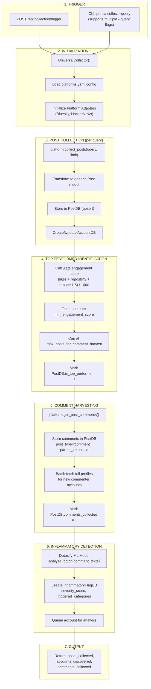
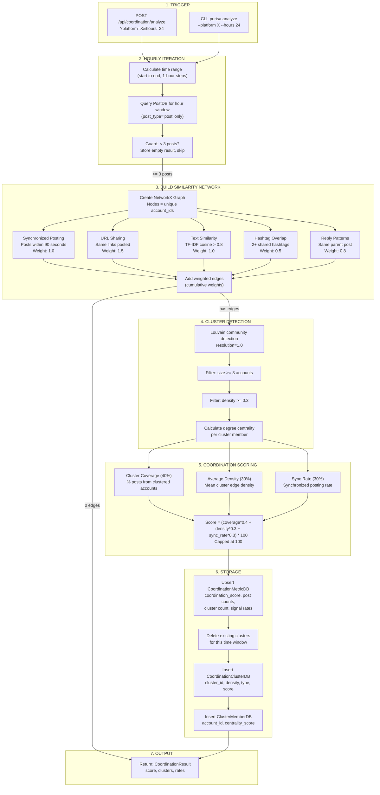
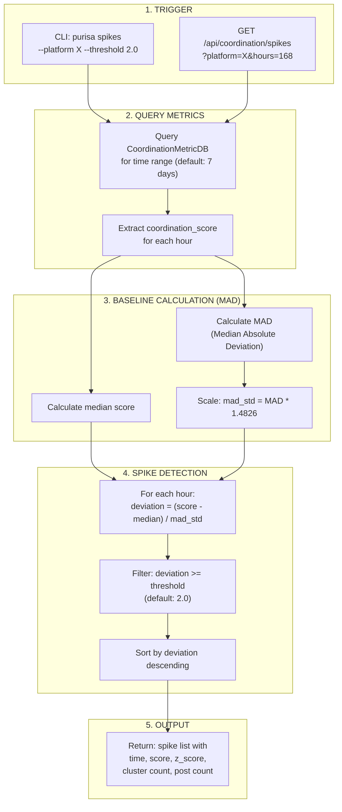

# Purisa Coordination Detection System - Flow Diagrams

Technical documentation for the collection and coordination analysis pipelines.

---

## Collection Flow

How posts and comments are collected from social media platforms.


```mermaid
flowchart TD
    subgraph Trigger["1. TRIGGER"]
        API["POST /api/collection/trigger"]
        CLI["CLI: purisa collect --query<br/>(supports multiple --query flags)"]
    end

    subgraph Init["2. INITIALIZATION"]
        UC["UniversalCollector()"]
        CFG["Load platforms.yaml config"]
        PLAT["Initialize Platform Adapters<br/>(Bluesky, HackerNews)"]
    end

    subgraph Collect["3. POST COLLECTION (per query)"]
        FETCH["platform.collect_posts(query, limit)"]
        TRANSFORM["Transform to generic Post model"]
        STORE_POST["Store in PostDB (upsert)"]
        STORE_ACCT["Create/Update AccountDB"]
    end

    subgraph TopPerf["4. TOP PERFORMER IDENTIFICATION"]
        CALC_ENG["Calculate engagement score<br/>(likes + reposts*2 + replies*1.5) / 1000"]
        FILTER["Filter: score >= min_engagement_score"]
        CAP["Cap at max_posts_for_comment_harvest"]
        MARK["Mark PostDB.is_top_performer = 1"]
    end

    subgraph Comments["5. COMMENT HARVESTING"]
        FETCH_COMMENTS["platform.get_post_comments()"]
        STORE_COMMENTS["Store comments in PostDB<br/>post_type='comment', parent_id=post.id"]
        FETCH_PROFILES["Batch fetch full profiles<br/>for new commenter accounts"]
        MARK_COLLECTED["Mark PostDB.comments_collected = 1"]
    end

    subgraph Inflammatory["6. INFLAMMATORY DETECTION"]
        DETOXIFY["Detoxify ML Model<br/>analyze_batch(comment_texts)"]
        FLAG["Create InflammatoryFlagDB<br/>severity_score, triggered_categories"]
        QUEUE["Queue account for analysis"]
    end

    subgraph Output["7. OUTPUT"]
        RESULT["Return: posts_collected,<br/>accounts_discovered,<br/>comments_collected"]
    end

    API --> UC
    CLI --> UC
    UC --> CFG --> PLAT
    PLAT --> FETCH --> TRANSFORM
    TRANSFORM --> STORE_POST --> STORE_ACCT
    STORE_ACCT --> CALC_ENG --> FILTER --> CAP --> MARK
    MARK --> FETCH_COMMENTS --> STORE_COMMENTS --> FETCH_PROFILES --> MARK_COLLECTED
    MARK_COLLECTED --> DETOXIFY --> FLAG --> QUEUE
    QUEUE --> RESULT
```

### Key Files - Collection

| Component | File |
|-----------|------|
| API Endpoint | `backend/purisa/api/routes.py` |
| Collector Service | `backend/purisa/services/collector.py` |
| Bluesky Adapter | `backend/purisa/platforms/bluesky.py` |
| HackerNews Adapter | `backend/purisa/platforms/hackernews.py` |
| Inflammatory Detector | `backend/purisa/services/inflammatory.py` |
| Database Models | `backend/purisa/database/models.py` |

### Configuration Parameters (Comment Harvesting)

```
limit (API/CLI parameter)
    |
    v
+--------------------------------------+
| Collect N posts from platform        |
| (controlled by 'limit' parameter)    |
+--------------------------------------+
    |
    v
+--------------------------------------+
| Filter by engagement score           |
| (min_engagement_score threshold)     |
|                                      |
| Example: 100 posts -> 40 qualify     |
+--------------------------------------+
    |
    v
+--------------------------------------+
| Cap at max_posts_for_comment_harvest |
|                                      |
| Example: 40 qualifying -> 50 cap    |
|          = 40 selected (no capping)  |
|                                      |
| Example: 60 qualifying -> 50 cap    |
|          = 50 selected (10 skipped)  |
+--------------------------------------+
    |
    v
+--------------------------------------+
| Harvest comments from selected posts |
| (max_comments_per_post per post)     |
+--------------------------------------+
```

| Parameter | Default | Location | Purpose |
|-----------|---------|----------|---------|
| `limit` | 100 | API/CLI | Max posts to collect initially |
| `min_engagement_score` | 0.01 | platforms.yaml | Threshold for "top performer" |
| `max_posts_for_comment_harvest` | 50 | platforms.yaml | Cap on posts to harvest comments from |
| `max_comments_per_post` | 100 | platforms.yaml | Max comments per top post |
| `fetch_commenter_profiles` | true | platforms.yaml | Fetch full profiles for commenters |

**Multi-query:** `--query` can be repeated (e.g., `--query "#politics" --query "#news"`). The `--limit` applies **per query**.

---

## Coordination Analysis Flow

How network-based coordination detection works using graph analysis.


```mermaid
flowchart TD
    subgraph Trigger["1. TRIGGER"]
        API["POST /api/coordination/analyze<br/>?platform=X&hours=24"]
        CLI["CLI: purisa analyze<br/>--platform X --hours 24"]
    end

    subgraph Loop["2. HOURLY ITERATION"]
        RANGE["Calculate time range<br/>(start to end, 1-hour steps)"]
        FETCH["Query PostDB for hour window<br/>(post_type='post' only)"]
        GUARD["Guard: < 3 posts?<br/>Store empty result, skip"]
    end

    subgraph Network["3. BUILD SIMILARITY NETWORK"]
        GRAPH["Create NetworkX Graph<br/>Nodes = unique account_ids"]
        SYNC["Synchronized Posting<br/>Posts within 90 seconds<br/>Weight: 1.0"]
        URL["URL Sharing<br/>Same links posted<br/>Weight: 1.5"]
        TEXT["Text Similarity<br/>TF-IDF cosine > 0.8<br/>Weight: 1.0"]
        HASH["Hashtag Overlap<br/>2+ shared hashtags<br/>Weight: 0.5"]
        REPLY["Reply Patterns<br/>Same parent post<br/>Weight: 0.8"]
        EDGES["Add weighted edges<br/>(cumulative weights)"]
    end

    subgraph Cluster["4. CLUSTER DETECTION"]
        LOUVAIN["Louvain community detection<br/>resolution=1.0"]
        FILTER_SIZE["Filter: size >= 3 accounts"]
        FILTER_DENSITY["Filter: density >= 0.3"]
        CENTRALITY["Calculate degree centrality<br/>per cluster member"]
    end

    subgraph Score["5. COORDINATION SCORING"]
        COVERAGE["Cluster Coverage (40%)<br/>% posts from clustered accounts"]
        DENSITY["Average Density (30%)<br/>Mean cluster edge density"]
        SYNCRATE["Sync Rate (30%)<br/>Synchronized posting rate"]
        CALC["Score = (coverage*0.4 +<br/>density*0.3 + sync_rate*0.3) * 100<br/>Capped at 100"]
    end

    subgraph Store["6. STORAGE"]
        METRIC["Upsert CoordinationMetricDB<br/>coordination_score, post counts,<br/>cluster count, signal rates"]
        DEL_OLD["Delete existing clusters<br/>for this time window"]
        CLUSTER_DB["Insert CoordinationClusterDB<br/>cluster_id, density, type, score"]
        MEMBER_DB["Insert ClusterMemberDB<br/>account_id, centrality_score"]
    end

    subgraph Output["7. OUTPUT"]
        RESULT["Return: CoordinationResult<br/>score, clusters, rates"]
    end

    API --> RANGE
    CLI --> RANGE
    RANGE --> FETCH --> GUARD
    GUARD -->|">= 3 posts"| GRAPH

    GRAPH --> SYNC & URL & TEXT & HASH & REPLY
    SYNC & URL & TEXT & HASH & REPLY --> EDGES

    EDGES -->|"0 edges"| RESULT
    EDGES -->|"has edges"| LOUVAIN --> FILTER_SIZE --> FILTER_DENSITY --> CENTRALITY

    CENTRALITY --> COVERAGE & DENSITY & SYNCRATE
    COVERAGE & DENSITY & SYNCRATE --> CALC

    CALC --> METRIC --> DEL_OLD --> CLUSTER_DB --> MEMBER_DB
    MEMBER_DB --> RESULT
```

### Key Files - Coordination Analysis

| Component | File |
|-----------|------|
| API Endpoint | `backend/purisa/api/routes.py` |
| CoordinationAnalyzer | `backend/purisa/services/coordination.py` |
| TextSimilarityCalculator | `backend/purisa/services/similarity.py` |
| URL/Hashtag Similarity | `backend/purisa/services/similarity.py` |
| Coordination DB Models | `backend/purisa/database/coordination_models.py` |

### Idempotent Re-analysis

- `cluster_id` uses `time_window_start.strftime('%Y%m%d_%H%M')` (not `datetime.now()`)
- Existing clusters are deleted before re-storing for the same time window
- `CoordinationMetricDB` uses upsert (update if exists, insert if new)

---

## Coordination Signals

### Network Edge Signals

Edges are created between accounts that exhibit coordinated behavior within a 1-hour window:

| Signal | Weight | Detection Method | Source |
|--------|--------|-----------------|--------|
| **Synchronized Posting** | 1.0 | Posts within 90 seconds of each other | `coordination.py` |
| **URL Sharing** | 1.5 | Sharing the same URLs (rarity-weighted) | `similarity.py` |
| **Text Similarity** | 1.0 | TF-IDF cosine similarity > 0.8 | `similarity.py` |
| **Hashtag Overlap** | 0.5 | 2+ shared hashtags (Jaccard similarity) | `similarity.py` |
| **Reply Patterns** | 0.8 | Commenting on the same parent posts | `coordination.py` |

Edge weights are **cumulative** — if two accounts share a URL AND post synchronously, their edge weight is 1.0 + 1.5 = 2.5.

**Deduplication:** Synchronized posting pairs are deduplicated per account pair (one edge per pair regardless of how many posts overlap). URL sharing uses inverse-frequency rarity weighting — viral URLs shared by many accounts score lower (0.1) while rare URLs score higher (1.0). TF-IDF text similarity requires a minimum corpus of 5 posts for meaningful IDF weights. Louvain community detection uses `seed=42` for deterministic results.

### Coordination Score Formula

```
coordination_score = (
    cluster_coverage * 0.4 +    # % of posts from clustered accounts
    avg_density      * 0.3 +    # Mean graph density of clusters
    sync_rate        * 0.3      # Rate of synchronized posting
) * 100
```

Capped at 100. Stored per hour in `CoordinationMetricDB`.

| Score | Interpretation |
|-------|---------------|
| 0-20 | Normal organic activity |
| 20-50 | Elevated coordination (may be natural) |
| 50-80 | High coordination (warrants investigation) |
| 80-100 | Very high coordination (likely campaign) |

### Cluster Detection Thresholds

| Parameter | Default | Purpose |
|-----------|---------|---------|
| `min_cluster_size` | 3 | Minimum accounts per cluster |
| `min_cluster_density` | 0.3 | Minimum edge density (30% of possible edges) |
| `louvain_resolution` | 1.0 | Community detection granularity |

---

## Spike Detection Flow

How unusual coordination activity is identified.


```mermaid
flowchart TD
    subgraph Trigger["1. TRIGGER"]
        CLI["CLI: purisa spikes<br/>--platform X --threshold 2.0"]
        API["GET /api/coordination/spikes<br/>?platform=X&hours=168"]
    end

    subgraph Query["2. QUERY METRICS"]
        FETCH["Query CoordinationMetricDB<br/>for time range (default: 7 days)"]
        SCORES["Extract coordination_score<br/>for each hour"]
    end

    subgraph Stats["3. BASELINE CALCULATION (MAD)"]
        MEDIAN["Calculate median score"]
        MAD["Calculate MAD<br/>(Median Absolute Deviation)"]
        SCALE["Scale: mad_std = MAD * 1.4826"]
    end

    subgraph Detect["4. SPIKE DETECTION"]
        ZSCORE["For each hour:<br/>deviation = (score - median) / mad_std"]
        FILTER["Filter: deviation >= threshold<br/>(default: 2.0)"]
        SORT["Sort by deviation descending"]
    end

    subgraph Output["5. OUTPUT"]
        RESULT["Return: spike list with<br/>time, score, z_score,<br/>cluster count, post count"]
    end

    CLI --> FETCH
    API --> FETCH
    FETCH --> SCORES --> MEDIAN & MAD
    MAD --> SCALE
    MEDIAN & SCALE --> ZSCORE --> FILTER --> SORT --> RESULT
```

### Spike Detection Thresholds

| Threshold | Sensitivity | Use Case |
|-----------|-------------|----------|
| 1.5 std devs | High | Catch subtle coordination |
| 2.0 std devs | Medium (default) | Balanced detection |
| 3.0 std devs | Low | Only major anomalies |

---

## Database Schema

```
CORE TABLES (models.py)
========================

+---------------+     +---------------+     +-----------------------+
|  AccountDB    |----<|   PostDB      |----<| InflammatoryFlagDB    |
|               |     |               |     |                       |
| id (PK)       |     | id (PK)       |     | post_id (FK)          |
| username      |     | account_id(FK)|     | account_id (FK)       |
| platform      |     | content       |     | severity_score        |
| follower_ct   |     | post_type     |     | toxicity_scores       |
| last_analyzed |     | parent_id(FK) |     | triggered_categories  |
+---------------+     | is_top_perf   |     +-----------------------+
      |               +---------------+
      |
      +----<+---------------+     +-------------------+     +-----------+
      |     |   ScoreDB     |     | CommentStatsDB    |     |  FlagDB   |
      |     |               |     |                   |     |           |
      |     | account_id(FK)|     | account_id (FK)   |     | acct (FK) |
      |     | total_score   |     | total_comments    |     | signals   |
      |     | signals       |     | inflammatory_ct   |     | flagged   |
      |     | flagged       |     | repetitive_ct     |     +-----------+
      |     +---------------+     +-------------------+
      |
COORDINATION TABLES (coordination_models.py)
=============================================
      |
      +----<+---------------------+     +-------------------------+
      |     | AccountEdgeDB       |     | CoordinationClusterDB   |
      |     |                     |     |                         |
      |     | account_id_1 (FK)   |     | cluster_id (UNIQUE)     |
      |     | account_id_2 (FK)   |     | platform                |
      |     | platform            |     | time_window_start/end   |
      |     | edge_type           |     | member_count            |
      |     | similarity_score    |     | density_score           |
      |     | time_window_start   |     | cluster_type            |
      |     | evidence (JSON)     |     | coordination_score      |
      |     +---------------------+     +-------------------------+
      |                                       |
      +----<+---------------------+           |
            | ClusterMemberDB     |<----------+
            |                     |
            | cluster_id (FK)     |
            | account_id (FK)     |
            | centrality_score    |
            | edge_count          |
            +---------------------+

+---------------------------+     +------------------+     +------------------------+
| CoordinationMetricDB      |     | EventDB          |     | EventCorrelationDB     |
|                           |     |                  |     |                        |
| platform                  |     | name             |     | event_id (FK)          |
| time_bucket               |     | platform         |     | metric_id (FK)         |
| bucket_type ('hourly')    |     | event_time       |     | correlation_strength   |
| coordination_score        |     | event_type       |     | lag_seconds            |
| total_posts_analyzed      |     | source           |     | notes                  |
| coordinated_posts_count   |     +------------------+     +------------------------+
| active_cluster_count      |
| insufficient_data         |
| sync/url/text rates       |
+---------------------------+
```

### Table Descriptions

| Table | Purpose |
|-------|---------|
| **AccountDB** | User profiles from social platforms |
| **PostDB** | Original posts and comments (`post_type` distinguishes) |
| **ScoreDB** | Legacy bot detection scores (13 signals) |
| **InflammatoryFlagDB** | Toxic comment flags with Detoxify ML scores |
| **CommentStatsDB** | Aggregated per-account comment statistics |
| **FlagDB** | Significant signal flags for accounts |
| **AccountEdgeDB** | Pairwise account similarity edges per time window |
| **CoordinationClusterDB** | Detected coordination clusters with density and type |
| **ClusterMemberDB** | Account-to-cluster membership with centrality scores |
| **CoordinationMetricDB** | Hourly coordination scores and signal rates |
| **EventDB** | User-contributed or auto-detected events for correlation |
| **EventCorrelationDB** | Links between coordination spikes and events |

**Registration:** `connection.py` imports `coordination_models` to ensure all tables are created by `Base.metadata.create_all()`.

---

## API Endpoints

### Collection

```
POST /api/collection/trigger
  ?platform=bluesky
  &query=#politics
  &limit=50
  &harvest_comments=true
```

### Coordination (2.0)

```
GET  /api/coordination/metrics?platform=bluesky&hours=24
GET  /api/coordination/spikes?platform=bluesky&hours=168&threshold=2.0
GET  /api/coordination/timeline?platform=bluesky&hours=168
GET  /api/coordination/clusters?platform=bluesky&hours=24&min_size=3
POST /api/coordination/analyze?platform=bluesky&hours=24
GET  /api/coordination/stats
```

### Legacy Analysis

```
POST /api/analysis/trigger
  ?account_id=<id>     # Single account (13-signal scoring)
  ?platform=bluesky    # All accounts on platform
```

### Stats & Health

```
GET /api/stats/overview        # System statistics
GET /api/stats/comments        # Comment statistics
GET /api/platforms/status       # Available platforms
GET /api/health                 # Health check
```

### Accounts

```
GET /api/accounts/all           # All accounts (paginated)
GET /api/accounts/flagged       # Flagged accounts (legacy)
```
